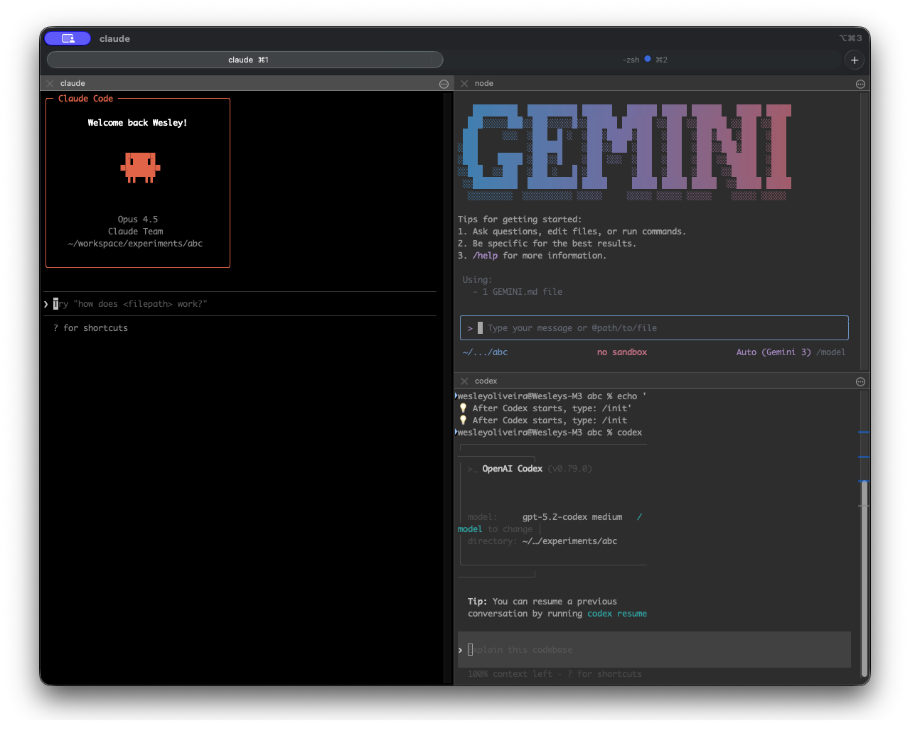

# AI Terminal Agent

[](CHANGELOG.md)
[](LICENSE)
[]()
[](CONTRIBUTING.md)
[](CODE_OF_CONDUCT.md)
[](SECURITY.md)

> Multi-AI workspace manager for iTerm2 - orchestrate Claude, Gemini, and Codex in a single terminal.



## Table of Contents

- [Features](#features)
- [Quick Start](#quick-start)
  - [Migrating Existing Projects](#migrating-existing-projects)
- [Commands](#commands)
- [Agent Management](#agent-management)
- [Shared Context](#shared-context)
- [Workflow Example](#workflow-example)
- [Prerequisites](#prerequisites)
- [Documentation](#documentation)
- [Contributing](#contributing)
- [Code of Conduct](#code-of-conduct)
- [Security](#security)
- [License](#license)

## Features

- **Unified CLI** - Single `ai` command with intuitive subcommands
- **Multi-AI Orchestration** - Claude, Gemini, and Codex in split panes
- **Dynamic Agents** - 47 specialized agents, 11 pre-defined profiles
- **Token Optimization** - Reduce usage from ~34k to ~8-12k tokens (60-70% savings)
- **Shared Context** - AIs share information via `.ai-context/`
- **Shell Completion** - Tab completion for all commands
- **Daily Summaries** - Automatic work reports generated by Gemini
- **Git Integration** - Global ignore for AI workspace files

## Quick Start

### Installation

```bash
git clone https://github.com/wesleyoliveira/ai-terminal-agent.git
cd ai-terminal-agent
./install.sh
source ~/.zshrc
```

### Basic Usage

```bash
cd ~/your-project
ai start              # Launch workspace with iTerm2 splits
ai stop               # Close with daily summary
ai status             # Check active workspaces
ai help               # Full documentation
```

### Migrating Existing Projects

If you have projects using the old structure (AGENTS.md, CLAUDE.md, old `.ai-context/`):

```bash
cd ~/your-old-project
ai stop               # Optional: save current work
ai migrate            # Interactive migration with backup
```

**What `ai migrate` does:**
1. Creates backup in `.ai-migrate-backup-TIMESTAMP/`
2. Preserves `decisions.md` and `agents-reference.md`
3. Removes old files (AGENTS.md, CLAUDE.md, old .ai-context/)
4. Runs `ai-start` to create new structure
5. Restores preserved files

```bash
# Preview changes without making them
ai migrate --dry-run

# Non-interactive migration
ai migrate --force
```

## Commands

```bash
ai <command> [options]

# Quick shortcuts
ai start [path]           # Start AI workspace
ai stop                   # Stop workspace
ai status                 # Show status

# Workspace management
ai workspace start        # Launch with iTerm2 splits
ai workspace stop         # Close and generate summary
ai workspace status       # Show active workspaces
ai workspace recent       # List recent workspaces
ai workspace recover      # Recover from crashes

# Agent management
ai agents list            # List all 47 agents
ai agents profile <name>  # Activate profile (minimal, frontend, backend, etc.)
ai agents stats           # Show token usage
ai agents suggest         # Get profile recommendation

# Context management
ai context init           # Initialize .ai-context/
ai context check          # Diagnose context state
ai context sync           # Sync AI configurations

# Configuration
ai config doctor          # Health check
ai config git --setup     # Configure git ignore
ai config update          # Update from git

# Migration (for old projects)
ai migrate                # Migrate to new structure
ai migrate --dry-run      # Preview changes
ai migrate --force        # Non-interactive
```

## Agent Management

Activate only the agents you need, reducing token usage significantly.

| Profile | Agents | Tokens | Best For |
|---------|--------|--------|----------|
| `minimal` | 2 | ~5k | Code review only |
| `frontend` | 4 | ~10k | React, Next.js, Vue |
| `backend` | 4 | ~11k | APIs, Node.js, Python |
| `fullstack` | 4 | ~11k | Full web applications |
| `mobile` | 3 | ~10k | iOS/Android, React Native |
| `devops` | 5 | ~14k | Kubernetes, Terraform |
| `data` | 4 | ~12k | Data engineering |
| `ai-ml` | 4 | ~12k | Machine learning |
| `security` | 4 | ~13k | Security audits |
| `docs` | 4 | ~10k | Documentation |
| `research` | 3 | ~10k | Research tasks |

```bash
# Activate a profile
ai agents profile fullstack

# Combine profiles
ai agents profile frontend+security

# Check token usage
ai agents stats
```

## Shared Context

The `.ai-context/` directory enables AIs to share information:

```
.ai-context/
├── project-status.md     # Project overview
├── current-task.md       # Active task
├── decisions.md          # Technical decisions
├── known-issues.md       # Bugs and limitations
└── roadmap.md            # Future plans
```

```bash
# Initialize context structure
ai context init --with-prompts
```

## Workflow Example

```
1. ai start
   └── iTerm2 opens with 3 AI panes

2. Claude (left): "Analyze this project and create .ai-context/project-status.md"
   └── Creates project summary

3. Gemini (top-right): "Research best JWT libraries for Node.js"
   └── Researches and recommends

4. Codex (bottom-right): "Implement JWT middleware"
   └── Writes the code

5. Claude: "Review the auth code"
   └── Validates and improves

6. ai stop
   └── Generates daily summary
```

### Layout

```
┌─────────────────────┬──────────────┐
│                     │   GEMINI     │
│                     │  (Research)  │
│      CLAUDE         ├──────────────┤
│    (Analysis)       │   CODEX      │
│                     │   (Code)     │
└─────────────────────┴──────────────┘
```

## Prerequisites

| Requirement | Installation |
|-------------|--------------|
| **macOS** 14+ | - |
| **iTerm2** | [iterm2.com](https://iterm2.com/) |
| **Claude CLI** | `npm install -g @anthropic-ai/claude-code` |
| **Gemini CLI** | `npm install -g @google/generative-ai` (optional) |
| **jq** | `brew install jq` |

> **Note:** This project currently supports macOS only due to iTerm2 and AppleScript dependencies. Contributions for Linux (tmux) or Windows Terminal support are welcome!

## Documentation

- [Quick Reference](docs/quick-reference.md) - Command cheatsheet
- [Installation Guide](docs/installation.md) - Detailed setup
- [Usage Guide](docs/usage.md) - How to use
- [Agent Management](docs/agent-management.md) - Agent system
- [Troubleshooting](docs/troubleshooting.md) - Common issues

## Contributing

Contributions are welcome! Please read our [Contributing Guide](CONTRIBUTING.md) for details.

1. Fork the repository
2. Create your feature branch (`git checkout -b feature/amazing-feature`)
3. Commit your changes (`git commit -m 'Add amazing feature'`)
4. Push to the branch (`git push origin feature/amazing-feature`)
5. Open a Pull Request

## Code of Conduct

Please read and follow our [Code of Conduct](CODE_OF_CONDUCT.md).

## Security

If you discover a security issue, please follow the instructions in
[SECURITY.md](SECURITY.md).

## License

This project is licensed under the MIT License - see the [LICENSE](LICENSE) file for details.

---

**[View Changelog](CHANGELOG.md)** | **[Report Bug](https://github.com/wesleyoliveira/ai-terminal-agent/issues)** | **[Request Feature](https://github.com/wesleyoliveira/ai-terminal-agent/issues)**
